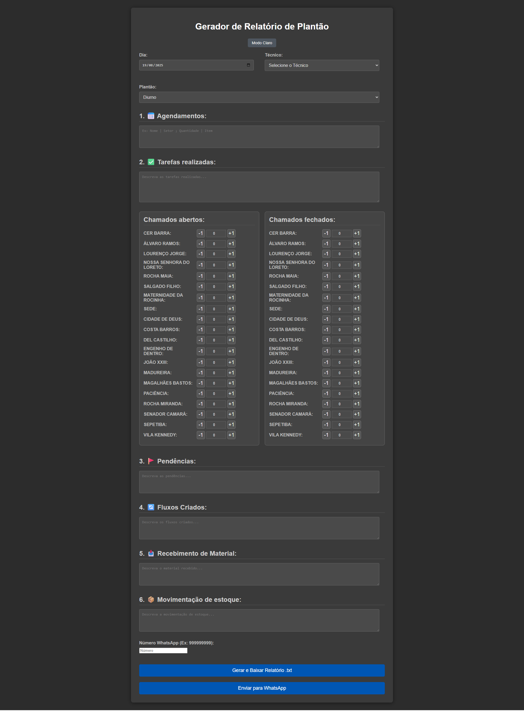

🇬🇧 English | 🇧🇷 Português (scroll down)

# Unit Control Form for Service Calls  
(Formulário de Controle de Unidades em Chamados)

This is a web form developed to keep track of units in service calls, making it easier to generate reports and monitor activities.

## Preview



The application uses JavaScript for flexibility and to enable the addition of new features in the future.

## How to Use

1. Open the web form.
2. Enter the date, technician's name, and shift.
3. If there are any scheduled appointments, list them as:  
   Requester's Name | Requester's Department | Item and Quantity Requested | Deadline for Use/Return.
4. If there is any specific task, just list it.
5. In the "Open Calls" and "Closed Calls" tables, you can manually enter the number of calls or, if using in real time, click +1 or -1 as needed.
6. The "Pending" section is especially for tasks that could not be completed during the shift and need to be addressed more urgently than a scheduled appointment.
7. "Created Flows" is for documenting any temporary or test solutions to particular cases so the whole team understands the workflow until a definitive process is created (or if the temporary process becomes the new standard).
8. "Material Receipt" should be listed in the following order: quantity / item / from whom / to whom – the more detailed, the better.
9. "Stock Movement" is for items already in stock, often requested by appointment and later returned (or not), ensuring basic material control.
10. "WhatsApp Number" – for the reality in which it was developed, where reports needed to be sent to a group including technicians and supervisors. By default, you need to be connected via WhatsApp Web (currently not functional in executable version; I plan to remove or fix this).
11. "Generate as .txt" – organizes and downloads the information as a text file. Any section not filled out will be reported as "no change," and only units with calls will appear (will improve to allow export to .xml or .csv).
12. "Send via WhatsApp".

---

## Executables for Windows and Linux

You can now download and run the form without needing to install Node.js!

### Download

- **Windows:** [Download formularioPlantao.exe](https://github.com/SEU_USUARIO/formularioPlantao/releases/latest) <!-- Replace with your actual repository and release link -->
- **Linux:** [Download formularioPlantao-linux](https://github.com/SEU_USUARIO/formularioPlantao/releases/latest) <!-- Replace with your actual repository and release link -->

### How to generate the executable (.exe and Linux) yourself

1. Install [Node.js](https://nodejs.org/) and [pkg](https://github.com/vercel/pkg):
   ```bash
   npm install -g pkg
   ```
2. Download/clone the project:
   ```bash
   git clone https://github.com/SEU_USUARIO/formularioPlantao.git
   cd formularioPlantao
   ```
3. Generate the executable for Windows:
   ```bash
   pkg . --targets node18-win-x64
   ```
   The `formularioPlantao.exe` file will be created in the project folder.

4. Generate the executable for Linux:
   ```bash
   pkg . --targets node18-linux-x64
   ```
   The `formularioPlantao-linux` file will be created in the project folder.

5. You can now run the program directly:

   - **Windows:**  
     Double-click `formularioPlantao.exe`
   
   - **Linux:**  
     Give execution permission (if needed) and run:
     ```bash
     chmod +x formularioPlantao-linux
     ./formularioPlantao-linux
     ```

---

## Technologies Used

- HTML
- CSS
- JavaScript
- Node.js
- Express.js

## Installation

1. Download and install [Node.js](https://nodejs.org/).
2. Open your terminal and navigate to your project folder.
3. Initialize your project with Node.js:
   ```
   npm init -y
   ```
4. Install Express:
   ```
   npm install express
   ```

## Contribution

Contributions are welcome! Feel free to open issues and pull requests.

## License

This project is licensed under the MIT License.

---

# 🇧🇷 Formulário de Controle de Unidades em Chamados

Este é um formulário web desenvolvido para contabilizar unidades em chamados, facilitando a geração de relatórios e o controle dos atendimentos.

## Visualização


A aplicação utiliza JavaScript para proporcionar flexibilidade e permitir a inclusão de novas funcionalidades no futuro.

## Como usar

1. Abra o formulário web.
2. Insira data, o nome do técnico, o turno.
3. Se houverem agendamentos, listar em:  
   Nome do Solicitante | Setor do Solicitante | o item e a quantidade a ser solicitado e o prazo para uso/devolução.
4. Havendo alguma tarefa a ser especificada, só listá-la.
5. Na tabela de Chamados Abertos e Chamados Fechados, deixei para livre digitação do número de chamados, mas caso esteja utilizando em tempo real, pode ir clicando em +1 ou -1 conforme a demanda.
6. Em Pendências, é em especial para atividades em que não puderam ser feitas durante o plantão e precisam ser mais urgentes que um agendamento.
7. Fluxos Criados foi pensado em caso alguma particularidade tenha uma solução temporária ou em testes para que toda a equipe entenda o andamento do fluxo até que se crie uma forma definitiva ou mesmo que esse fluxo se torne o padrão.
8. Recebimento de Material é listar em ordem: quantitativo / item / de quem / para quem – quanto melhor detalhado, melhor.
9. Movimentação de Estoque, pensado para os itens que já temos e que por vezes são solicitados por agendamento e devolvidos (ou não), mantendo um controle básico de material.
10. Número de Whatsapp – para a realidade em que foi desenvolvido, onde precisávamos enviar o relatório para um grupo onde estávamos técnicos e supervisão. Por padrão, precisa estar conectado via web (no momento não está funcional caso em executável, pretendo retirar ou corrigir a aplicação).
11. Gerar em .txt – organiza as informações e baixa num texto. O que não for lançado será reportado como “sem alteração”, e as unidades só aparecerão as que tiverem chamados (para melhorar pretendo incluir exportação para .xml ou .csv).
12. Enviar por whatsapp.

---

## Executáveis para Windows e Linux

Agora você pode baixar e executar o formulário sem precisar instalar o Node.js!

### Download

- **Windows:** [Baixar formularioPlantao.exe](https://github.com/SEU_USUARIO/formularioPlantao/releases/latest) <!-- Troque pelo link real do seu repositório e release -->
- **Linux:** [Baixar formularioPlantao-linux](https://github.com/SEU_USUARIO/formularioPlantao/releases/latest) <!-- Troque pelo link real do seu repositório e release -->

### Como gerar o executável (.exe e Linux) por conta própria

1. Instale o [Node.js](https://nodejs.org/) e o [pkg](https://github.com/vercel/pkg):
   ```bash
   npm install -g pkg
   ```
2. Baixe/clone o projeto:
   ```bash
   git clone https://github.com/SEU_USUARIO/formularioPlantao.git
   cd formularioPlantao
   ```
3. Gere o executável para Windows:
   ```bash
   pkg . --targets node18-win-x64
   ```
   O arquivo `formularioPlantao.exe` será criado na pasta do projeto.

4. Gere o executável para Linux:
   ```bash
   pkg . --targets node18-linux-x64
   ```
   O arquivo `formularioPlantao-linux` será criado na pasta do projeto.

5. Agora você pode executar o programa diretamente:

   - **Windows:**  
     Clique duas vezes no `formularioPlantao.exe`
   
   - **Linux:**  
     Dê permissão de execução (se necessário) e rode:
     ```bash
     chmod +x formularioPlantao-linux
     ./formularioPlantao-linux
     ```

---

## Tecnologias utilizadas

- HTML
- CSS
- JavaScript
- Node.js
- Express.js

## Instalação

1. Baixe e instale o [Node.js](https://nodejs.org/).
2. Abra o terminal e vá até a pasta do seu projeto.
3. Inicialize o projeto Node.js:
   ```
   npm init -y
   ```
4. Instale o Express:
   ```
   npm install express
   ```

## Contribuição

Contribuições são bem-vindas! Sinta-se à vontade para abrir issues e pull requests.

## Licença

Este projeto está licenciado sob a licença MIT.
